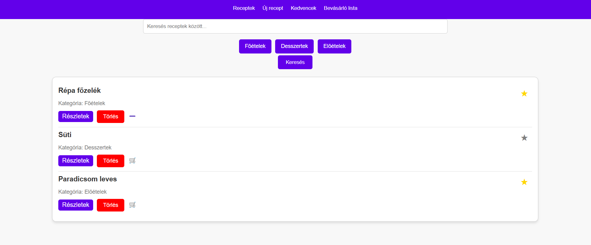
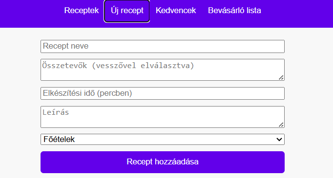
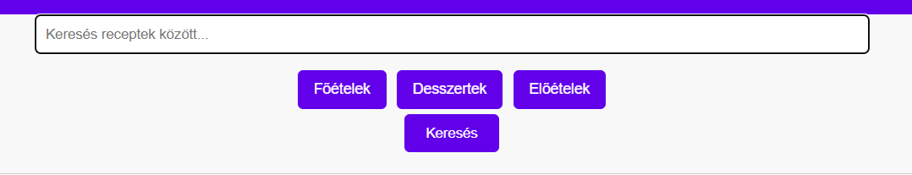
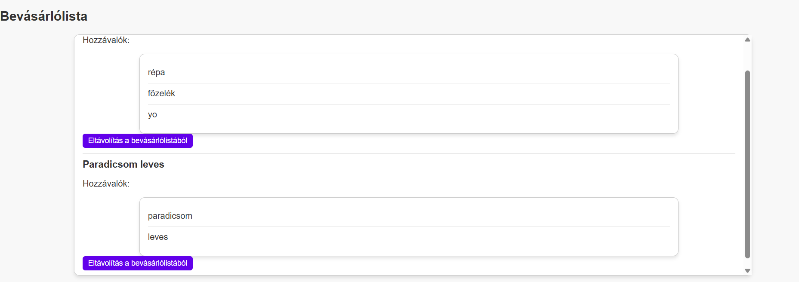

# Recept App

Ez az alkalmazás lehetőséget ad saját receptek tárolására, rendszerezésére és kezelésére.  
A fő funkciók között megtalálható az új receptek hozzáadása, keresés, kategória szerinti szűrés valamint egy dinamikus bevásárlólista összeállítása.

## Fő funkciók

### Új recept hozzáadása
Lehetőség van saját receptek létrehozására, ahol megadhatod:
- Recept nevét
- Hozzávalókat
- Leírást
- Elkészítési időt
- Kategóriát

---

### Receptek keresése
A meglévő receptek között gyorsan kereshetsz:
- **Név alapján**
- **Hozzávalók alapján**
- **Kategória alapján**

---

### Bevásárlólista
A bevásárlólista automatikusan összegyűjti a kiválasztott kedvenc receptek hozzávalóit, így könnyedén tervezheted meg a vásárlást.

---

## Technológiák
- **React** + **TypeScript**
- **React Router** az oldalak közötti navigációhoz
- **CSS** az alapvető stílushoz
- **Custom Hookok** (`useLocalStorage`, `useFetch`) az adatok kezelésére
- **LocalStorage** használata a receptek mentéséhez

## Futtatás

Az alkalmazás elérhető a [http://kardosmate.github.io/Recept_app/dist](http://kardosmate.github.io/Recept_app/dist) címen.
